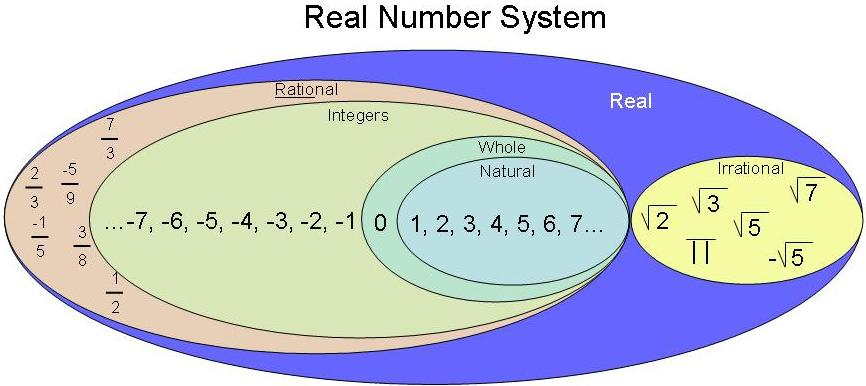

# School-matey
This is for school stuff yo

https://bournetocode.com/projects/GCSE_Practical_Programming/pages/Git-Cheat-Sheet.html


# AQA CS AS Notes

## 3.5 Fundamentals of data representation

### 3.5.1 Number systems
#### - Natural numbers

**definition**: those are numbers used for counting.

**examples**: 0,1,2,3,4
``` 

Counting uses natural number
A set of natural number can expressed as:
N={0,1,2,3...}

```

#### - Integer numbers

**definition**: a number that isn't fractional. A whole number.

**examples**: 1, 6, 9, are integer numbers. 3.14, 3.7, 7.8 are not integer numbers.


#### - Rational numbers

**definition**: a number that can be written as a ratio. It can be written as a fraction in which both the numerator and denominator are whole numbers.

**examples**: 8/1, 9/3, 7/16


#### - Irrational numbers

**definition**: any real number than can't be expressed as a ratio of integers.

**examples**: Pi, Sqrt(2)


#### - Ordinal numbers

**definition**: A number which describes the numerical position of an object.

**examples"": 1st, 2nd, 3rd, 4th


#### - Real numbers

**definition**: Numbers that can be found on the number line. This includes both rational and irrational numbers.

**examples**: 

</img>


### 3.5.2 Number bases
+ base 2: those are binary numbers. example: 1010<sub>2</sub>. See [this site](https://bournetocode.com/projects/AQA_AS_Theory/pages/3-5.html) for more infomation
+ base 10
+ base 16
+ conversion between denary, binary and hex

### 3.5.3 Units of information
+ bit and bytes
+ units of kilo, kilbi etc

### 3.5.4 Binary number system

#### unsigned binary

#### unsigned binary arithmetics
#### signed binary with two's complement
#### fixed point form binary representation of numbers with fractional parts

### 3.5.5 Information encoding system

#### Character form of a decimal digit
#### ASCII and Unicode
#### Error checking and correction

### 3.5.6 Representing images, sound and other data

#### Bit patterns, images,  sound  and other  data
#### Analogue and digital
#### Analogue and digital conversion
#### Bitmapped graphics
#### Digital representation of sound
#### Musical Instrument Digital Interface (MIDI)
#### Data compression
#### Encryption
